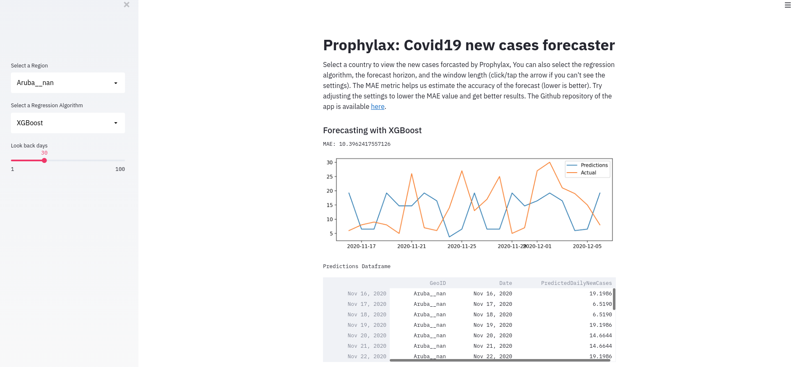

# Prophylax: Covid19 new cases forecaster



## Packages used:

- Sklearn
- XGBoost
- Streamlit
- Docker


## Run locally

```sh
virtualenv venv -p python3
source venv/bin/activate 
pip install -r requirements.txt

make run
```

